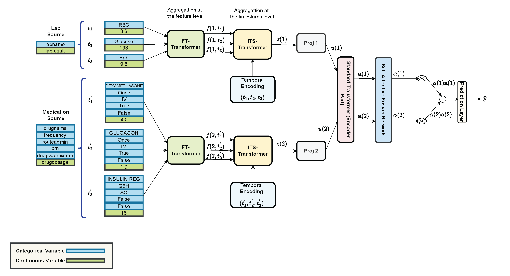

# MITST: Multi-source Irregular Time-Series Transformer for ICU Glucose Level Prediction

**MITST** (Multi-source Irregular Time-Series Transformer) is a novel machine learning model designed to predict blood glucose (BG) levels in ICU patients using complex, multi-source electronic health record (EHR) data. MITST's modular, hierarchical Transformer architecture processes multi-source and irregular time-series data (e.g., lab results, medications, vital signs), capturing both short-term and long-term temporal dependencies in a flexible way. It offers a scalable and adaptable approach for accurate BG level predictions and other ICU prediction tasks. Below is an illustration of the high-level architecture.



---

## Getting Started

To set up and run the code for the MITST model, follow the steps below.

### Prerequisites

1. **Database Setup**  
   First, ensure that the eICU database is properly set up as described by the eICU data maintainers. Follow their guidelines at [eICU Data Setup](https://github.com/MIT-LCP/eicu-code/tree/main/build-db/postgres).

2. **Environment Setup**  
   Create a virtual environment using Python 3.10. Then, install the required packages by running:

   ```bash
   pip install -r requirements.txt

3. **Update Patient Table**
   Update the `patient` table in the database to include previous and next visits. This will be used for concatenating consecutive ICU stays for a single patient within a specific hospital. Run the following command in your SQL environment:  

    ```bash
   psql -U your_username -d your_db_name -f concepts/add_previous_next_visits.sql


## Running the Code
Activate your virtual environment and navigate to the `code/` directory. Update `db_params` dictionary in the `db_conn.py` file with your database information (if necessary):
```python
db_params = {
    "dbname": "your_db_name",
    "user": "your_username",
    "password": "your_password"
}
```

1. **Extract Information from Each Stay** 
    Run the following script to extract data from each ICU stay and save it as individual JSON records. Each line in the final JSONL file represents one stay:
    ```bash
   python3 preprocess_database.py

2. **Concatenate Consecutive  Stays and Process Labels** 
    Use the following script to concatenate consecutive ICU stays for the same patient. Only stays with at least six BG measurements are included in the final dataset:
    ```bash
   python3 concatenate_admissions_and_preprocess_labels.py

3. **Feature Generation** 
    Now, transform the data to a format compatible with the MITST model by running:
    ```bash
   python3 feature_generation.py

4. **Train the MITST Model** 
    Once the data is prepared, train the MITST model using:
    ```bash
   python3 train.py

5. **Model Evaluation** 
    Finally, after training, evaluate the model on the test set to compute AUROC and AUPRC metrics for each class:
    ```bash
   python3 evaluation.py

## Citation
If you find MITST helpful in your research, please consider citing our preprint:

```plaintext
@article{mehdizavareh2024mitst,
  title={Enhancing Glucose Level Prediction of ICU Patients through Irregular Time-Series Analysis and Integrated Representation},
  author={Mehdizavareh, Hadi and Khan, Arijit and Cichosz, Simon Lebech},
  journal={arXiv preprint arXiv:2400.00000},
  year={2024}
}
```

## Acknowledgements
1. Special thanks to the eICU team for providing access to this large-scale EHR dataset. Their work enables impactful research in healthcare analytics. Learn more at [eICU GitHub Repository](https://github.com/MIT-LCP/eicu-code).
2. We extend our appreciation to the teams behind the FT-Transformer and Tab-Transformer for their open-source implementations, which inspired aspects of MITST. See their project at [FT-Transformer GitHub Repository](https://github.com/lucidrains/tab-transformer-pytorch/tree/main).

